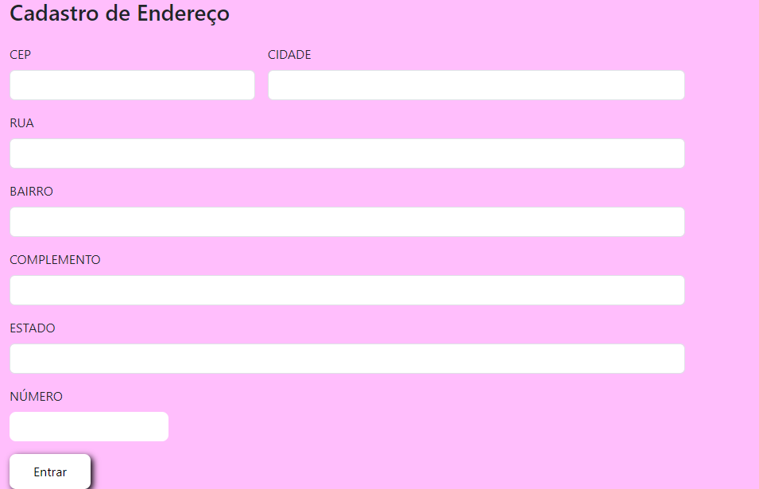
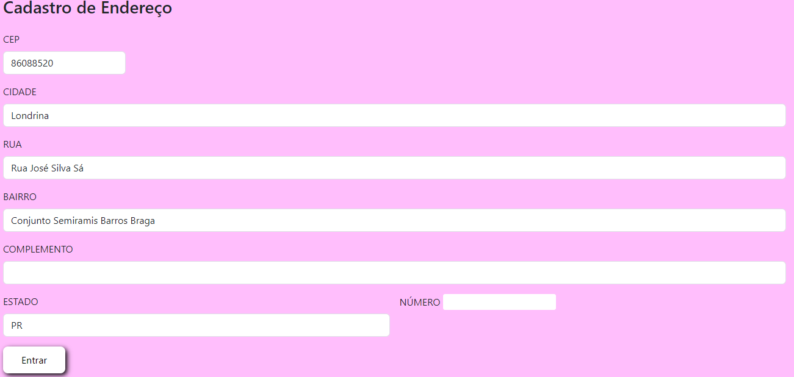
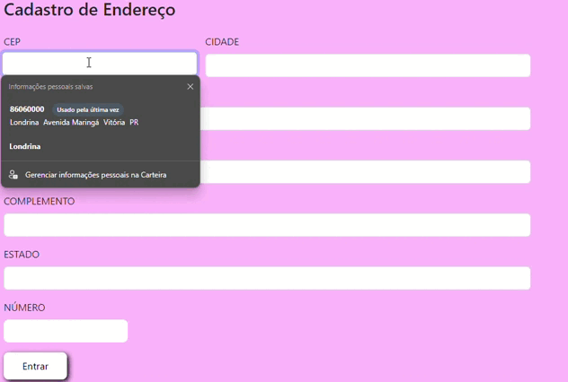

# Cadastro de Endereço📍

O código HTML fornecido cria uma página simples de cadastro de endereço, com campos para o usuário preencher dados como CEP, cidade, rua, bairro, estado, número e complemento. 

# Estrutura Básica do Documento HTML 📐

O documento começa com o &lt;!DOCTYPE html&gt;, que informa ao navegador que este é um documento HTML5. 
Em seguida, temos a tag &lt;html&gt;, que envolve todo o conteúdo da página, e dentro dela, duas seções principais: o &lt;head&gt; e o &lt;body&gt;.

&lt;meta charset='utf-8'&gt;: Define o conjunto de caracteres como UTF-8, garantindo que caracteres especiais sejam exibidos corretamente. 

&lt;meta http-equiv='X-UA-Compatible' content='IE=edge'&gt;: Garante compatibilidade com o Internet Explorer.

&lt;meta name='viewport' content='width=device-width, initial-scale=1'&gt;: Define que a página será responsiva, ajustando-se à largura da tela do dispositivo.

&lt;title&gt; Define o título da página, que é exibido na aba do navegador.

# Importação de Estilos e Scripts 📤

No &lt;head&gt;, além de meta-informações, vemos a importação do Bootstrap, um framework CSS popular para estilizar páginas de forma responsiva e rápida.

&lt;link &gt;Carrega o arquivo CSS do Bootstrap para estilizar os elementos da página.

&lt;link rel="stylesheet" href="cad.css"&gt;: Importa um arquivo CSS externo chamado cad.css para aplicar estilos personalizados.

&lt;script src='cad.js'></script&gt;: Importa um arquivo JavaScript chamado cad.js que, provavelmente, será usado para adicionar interatividade ao formulário, como validações de campos.

# Estrutura do Formulário 📏

No corpo da página (&lt;body&gt;), o código principal é o formulário que permite o cadastro de endereços. Ele é criado com a tag, 
&lt;form class="row g-3"&gt; e dentro dessa tag temos diversos campos de input.

<h3&gt; Cadastro de Endereço: Um título simples para o formulário.

Campo CEP: Um campo de texto (&lt;input type="text"&gt;) para o usuário inserir o CEP.

Campo Cidade: Outro campo de texto para o preenchimento da cidade.

Campos Rua, Bairro, Complemento, Estado e Número: Campos de entrada de texto para coletar o endereço completo.

Todos os campos estão dentro de uma estrutura, &lt;div class="col-md-6/col-12"&gt; que define o layout responsivo, com o Bootstrap ajustando o tamanho dos campos com base no tamanho da tela do usuário.


# Botão de Envio ⌨️

No final do formulário, há um botão de envio com a tag, &lt;button type="submit"&lt;Entrar&lt;/button> estilizado com a classe btn-primary, que aplica o estilo de um botão azul conforme o padrão do Bootstrap.

# Estilização do Backgroun 🫧

O corpo da página possui uma cor de fundo definida como &lt;rgb(255, 190, 252)&gt;, dando à página uma aparência visual personalizada com um tom de rosa claro.

# Função pesquisarCep 📬

Essa é uma função assíncrona (definida como async), ou seja, ela permite a utilização de promessas (promises), o que é útil para realizar operações que podem demorar um pouco, como acessar APIs.

# limparFormulario() 🧹🪣

A função provavelmente limpa os campos de formulário antes de buscar as informações. Essa parte do código não está visível, mas podemos deduzir que apaga qualquer dado que já tenha sido preenchido.

# Construção da URL 🪚

A variável url monta o endereço da API ViaCEP, substituindo ${cep.value} pelo valor do CEP digitado pelo usuário:

# js

Copiar código
```
const url = `https://viacep.com.br/ws/${cep.value}/json/`; 
```
Esse URL é usado para buscar os dados de endereço relacionados ao CEP.

# Verificação do CEP 📃

A função cepValido(cep.value) é chamada para verificar se o CEP informado pelo usuário é válido. Novamente, essa função não está visível, mas deve validar o formato correto do CEP.

# Busca dos Dados 🔎

Se o CEP for válido, a função entra no bloco if e usa o método fetch para fazer a requisição à API:


Copiar código
```
const dados = await fetch(url);
```
Aqui, o await faz a função esperar a resposta da API antes de continuar. Depois que a resposta chega, ela é convertida para JSON:

# js

Copiar código
```
const addres = await dados.json();
```

# Tratamento de Erros ❌

Após a obtenção dos dados, o código verifica se a propriedade erro está presente no objeto addres retornado pela API:

# js
Copiar código
```
if(addres.hasOwnProperty('erro')){
    alert("CEP não encontrado");
}
```
Se a API retornar um erro (por exemplo, se o CEP não existir), uma mensagem de alerta é mostrada para o usuário.

# Preenchimento do Formulário 📇

Caso não haja erro, a função preencherFormulario(addres) é chamada para preencher o formulário com os dados do endereço retornado pela API. Essa função também não está visível, mas deve preencher campos como "rua", "bairro", etc.

# CEP Inválido 🚫

Se o CEP digitado não for válido, o código cai no else final, exibindo um alerta:

# js
Copiar código
```
alert("Cep incorreto...");
```

# Evento de Escuta 🔊

No final, um "escutador" de eventos é adicionado ao campo de CEP:

# js
Copiar código
```
document.getElementById("cep").addEventListener("focusout", pesquisarCep);
```
Ele dispara a função pesquisarCep quando o usuário sai (dá "focusout") do campo onde digitou o CEP. Assim, ao digitar o CEP e clicar fora do campo, a busca na API é automaticamente iniciada.

O &lt;addEventListener&gt; é um método do JavaScript usado para registrar (ou "ouvir") eventos em elementos do DOM, como cliques, teclas pressionadas, mudanças de input, entre outros. Com ele, você pode adicionar uma função para ser executada quando um determinado evento ocorre.


# Resumo 🚀

Esse código permite que, ao digitar um CEP e sair do campo, uma busca na API ViaCEP seja feita para obter informações do endereço. Ele trata erros de CEP inválido ou não encontrado e atualiza automaticamente o formulário com os dados retornados.

# Imagens e gif do projeto 🏞️








# Autores ✒️
```
https://github.com/MilaKarol
```

```
https://github.com/ESChrystian/ESChrystian
```